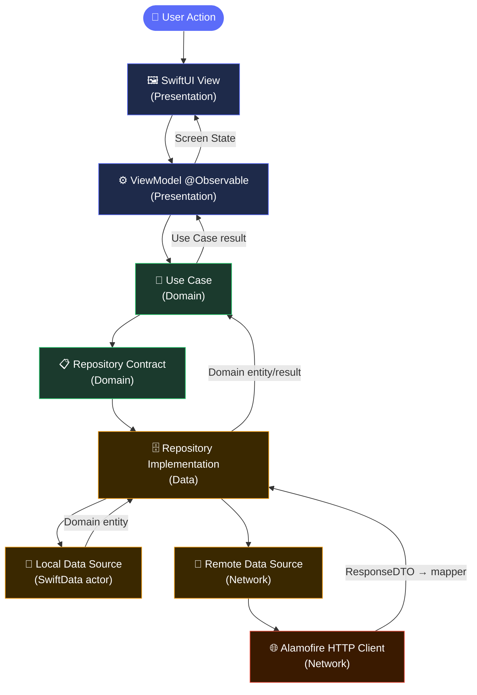
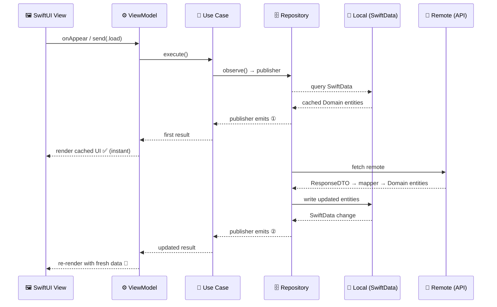

# 🌤️ Awan iOS

Awan is a bilingual day-planning app for iOS that turns goals and tasks into practical daily schedules. It combines AI-assisted goal decomposition, a dependency-aware scheduling engine, reusable daily-zone templates, and gamified progress tracking in a modular SwiftUI codebase built with layer-first Clean Architecture.

## ✨ Highlights

- 📅 Build a complete daily plan from tasks, goals, daily zones, availability windows, and task dependencies.
- 🤖 Break goals into tasks with an AI-assisted conversational planner, review proposed sessions, and adjust the schedule before confirming it.
- 🎙️ Capture tasks manually, by voice, or from a photo or camera image.
- 🏆 Track sessions, deadlines, points, streaks, inventory, and marketplace rewards.
- 🌐 Use the app in **English or Arabic** with automatic right-to-left layout and light/dark appearance preferences.
- 💾 Keep scheduling, profile, category, and gamification state in a **SwiftData-backed local cache** synchronized through repository abstractions.

## 🏛️ Architecture

Awan uses **layer-first Clean Architecture**: features repeat inside shared layer packages instead of becoming a package per feature. The app target is the composition root, where Swinject assemblies connect concrete infrastructure to Domain contracts and inject use cases, view models, factories, and coordinators.

| Layer / Pattern | Responsibility |
|---|---|
| 🚀 **Awan app** | Creates the persistent `ModelContainer`, configures platform services, assembles dependencies, and launches the root presentation flow. |
| 🖼️ **Presentation** | SwiftUI screens, `@Observable` / `@MainActor` view models, screen state, presentation mapping, typed routes, and coordinators. Complex screens use a unidirectional **Model-View-Intent** flow. |
| 🧠 **Domain** | UI- and infrastructure-independent entities, value objects, business rules, scheduling services, repository contracts, typed errors, and focused use cases. |
| 🗄️ **Data** | Repository implementations, remote and local data sources, DTO/persistence mapping, cache coordination, and SwiftData actors. |
| 🌐 **Network** | Alamofire-based transport, endpoint contracts, encoding/decoding, multipart uploads, authentication interception, and token refresh. |
| 🧩 **Common** | Shared design-system tokens and components, localization, media abstractions, coordinator contracts, and reusable utilities. |

### 🧱 Design Patterns

| Pattern | Role |
|---|---|
| 🖼️ **MVVM** | `@Observable @MainActor` view models hold screen state and translate user events into use-case calls. Views remain declarative and render state only. |
| 🔄 **MVI (Model-View-Intent)** | Complex screens expose a single `send(_ action:)` entry point and one observable state struct, enforcing unidirectional data flow. |
| 🗺️ **Coordinator + Typed Routes** | Dedicated coordinator objects own navigation stacks and modal state. Typed route enums describe every destination, keeping navigation logic out of views and view models. |
| 📦 **Repository** | Domain defines the repository protocol; Data provides the implementation. The Presentation layer never touches a concrete data source directly. |



Transport DTOs and SwiftData models stop at the Data boundary. Presentation renders Domain results through observable UI state and never accesses persistence or networking directly.

### ⚡ Local-First Caching Flow

For read-heavy data (tasks, sessions, zones, gamification), repositories serve local cache **immediately** via a retained Combine publisher, then fetch remote data and write it back into SwiftData. The same publisher emits the update automatically — no extra trigger needed from the view.



## 🛠️ Tech Stack

| Concern | Technology | Role in Awan |
|---|---|---|
| 📱 Language and UI | Swift, SwiftUI | Builds the iOS interface and app composition layer. |
| 🔄 State management | Observation, Combine | Drives main-actor view-model state and reactive streams from cached repository data. |
| ⚡ Concurrency | Swift concurrency | Implements asynchronous use cases, networking, persistence coordination, and parallel data loading with `async`/`await`. |
| 💾 Persistence | SwiftData | Stores goals, tasks, sessions, zones, templates, overrides, profile data, categories, and gamification inventory through actor-backed data sources. |
| 🌐 Networking | Alamofire | Provides typed HTTP requests, validation, multipart uploads, authenticated requests, and refresh handling. |
| 🔑 Session storage | SimpleKeychain | Persists authentication session material and the per-install device identifier. |
| 🔐 Authentication | Firebase Authentication, Google Sign-In | Exchanges Google credentials and manages the backend authentication flow alongside email OTP sign-in. |
| 💉 Dependency injection | Swinject | Organizes Data, Domain, and Presentation registrations at the app composition root. |
| 🎞️ Media and motion | Kingfisher, Lottie | Loads authenticated remote images and renders mascot, streak, and reward animations. |
| 🍎 Apple frameworks | Speech, AVFAudio, PhotosUI, UserNotifications | Supports voice input, camera/photo task extraction, and local session/deadline reminders. |
| 🔧 Tooling | Swift Package Manager, XCTest, SwiftLint, GitHub Actions | Manages modular dependencies, layer-focused test targets, linting, and simulator build checks. |

The application targets **iOS 18**. The development toolchain is **Xcode 16**; CI runs on macOS 14 with Xcode 15.4.

## 📁 Module Structure

```text
Awan-iOS/
├── Awan/                  # 🚀 App entry point, composition root, Swinject assemblies
├── Modules/
│   ├── Common/            # 🧩 Design system, localization, shared utilities
│   ├── Domain/            # 🧠 Entities, use cases, repository contracts, scheduling services
│   ├── Network/           # 🌐 Alamofire client, endpoints, DTOs, token refresh
│   ├── Data/              # 🗄️ Repository implementations, SwiftData actors, mappers
│   └── Presentation/      # 🖼️ SwiftUI screens, view models, coordinators, routes
├── AwanTests/             # 🧪 Unit tests across all layers
├── AwanUITests/           # 🧪 UI tests
└── .github/workflows/     # ⚙️ SwiftLint + simulator build CI
```

Feature folders span only the layers they need. Scheduling, templates, gamification, onboarding, profile, authentication, and AI-assisted creation retain clear boundaries without duplicating package infrastructure.

## 🚀 Key Features

- 📅 **Adaptive daily planning:** day and week navigation, session timelines, drag-based rescheduling with time snapping, completion tracking, and schedule updates.
- 🔗 **Dependency-aware scheduling:** Domain services order task dependencies, detect missing or cyclic relationships, find category-zone availability, exclude occupied time, and propose resolutions when time is insufficient.
- 🤖 **Goal planning assistant:** conversational goal decomposition, proposal confirmation, schedule generation, session review and editing, and explicit handling for unresolved tasks.
- 🎙️ **Flexible task capture:** manual and scheduled tasks, text-based proposals, speech transcription, and image-to-task extraction from the photo library or camera.
- 📋 **Task and goal management:** searchable inbox, task details, goal assignment, dependency editing, session editing, deadlines, completion, reopening, and deletion flows.
- 🗂️ **Daily zones and templates:** reusable weekday templates, date-specific overrides, categorized time zones, overlap validation, reordering, and bulk persistence.
- 🏆 **Gamified progress:** points, streak celebrations, activity history, a daily wheel, storefront browsing, purchases, inventory, and item equip/unequip flows.
- 🔐 **Authentication and onboarding:** email OTP and Google Sign-In flows, profile setup, wake/sleep preferences, scheduling preferences, zone setup, and notification consent.
- 🔔 **Localized reminders:** session alerts before and at start time plus goal-deadline reminders, with localized English and Arabic content.
- 👤 **Profile personalization:** profile photo and personal details, theme and language preferences, scheduling settings, equipped cosmetics, and secure logout with local-data cleanup.

## ✅ Quality and Verification

The repository contains XCTest targets across the architecture packages and the application. Existing suites exercise scheduling rules, dependency ordering, use cases, template resolution, endpoint contracts, DTO decoding, SwiftData data sources, repository coordination, and presentation view models.

The GitHub Actions CI workflow runs on every push to `main` and `development`:

1. 🔍 **SwiftLint** — strict lint check with GitHub Actions log reporting.
2. 🏗️ **Build** — unsigned iOS Simulator build via `xcodebuild`, with Swift Package Manager dependency caching.

Concurrency on the same ref is cancelled automatically.

## 🏁 Getting Started

### Prerequisites

- 🛠️ Xcode 16 or later
- 📱 iOS 18 Simulator or device

### Setup

```bash
# Clone the repository
git clone https://github.com/Awan-app/Awan-iOS.git
cd Awan-iOS

# Open the workspace (SPM dependencies resolve automatically)
open Awan.xcworkspace
```

> **Note:** The project uses `Secrets.xcconfig` for API keys and Firebase configuration. Obtain the file from a team member before building. `GoogleService-Info.plist` is included in the repository for Firebase initialization.

## 👥 Team

- [Eslam Elnady](https://github.com/EslamElnady0)
- [Andrew Magdy](https://github.com/Andrew-Magdy-1)
- [Menna Mohamed](https://github.com/MennaMohamed23)
- [Ahmed Sayed](https://github.com/ahmedSayed321)
