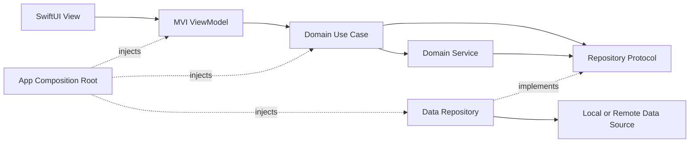
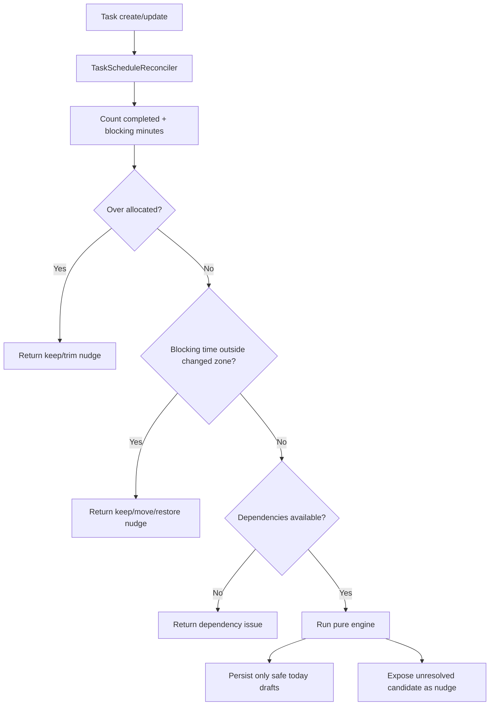
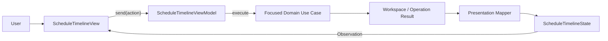

# Awan Scheduling Domain, Engine, and Presentation MVI

This guide explains the scheduling feature as it is currently implemented. It is intended as a study map: begin with the concepts, follow the runtime flows, and then use the linked source files to read the implementation in a useful order.

## 1. Architectural Shape

Awan uses Clean Architecture with dependencies pointing inward toward Domain.



The layer responsibilities are:

- **Domain** owns scheduling meaning and decisions: entities, value objects, repository contracts, use cases, the engine, reconciliation, and conflict-resolution behavior.
- **Data** owns storage implementations and mapping. The current implementation uses an actor-backed in-memory data source.
- **Presentation** owns screen actions, observable UI state, UI-only models, formatting, and rendering.
- **Awan app target** is the composition root. Swinject is used only here to connect concrete implementations.

The most important dependency rule is that Domain knows nothing about SwiftUI, Observation, Swinject, storage, or HTTP.

## 2. Domain Vocabulary

### Task

`AwanTask` describes work that must be completed. It contains:

- A UUID and title.
- An optional goal UUID.
- An optional zone UUID.
- An estimated duration.
- Whether the work may be split into multiple sessions.
- UUIDs of tasks that must be completed before it.

A task describes **what** is required. It does not contain a scheduled date or time.

Source: [`AwanTask.swift`](Modules/Domain/Sources/Domain/Scheduling/Entities/AwanTask.swift)

### Session

`Session` is the smallest scheduled unit. It connects a task to an exact `TimeRange` and optionally to a zone.

Its status is one of:

- `planned`
- `completed`
- `missed`
- `cancelled`

Its `blocking` Boolean expresses ownership of the time placement:

- `blocking == false`: the engine owns the placement and may rebuild it during reconciliation.
- `blocking == true`: the time was explicitly chosen or protected by the user. Automatic scheduling treats that time as sacred.

Dragging a session makes it blocking. Increasing the duration of a blocking task extends its existing planned session rather than creating an engine-owned remainder. Turning blocking off in task details deletes the planned placement and lets the engine plan it again.

Two computed rules are used throughout scheduling:

- `contributesScheduledWork`: planned and completed sessions count toward task duration.
- `occupiesTime`: planned and completed sessions occupy calendar space; missed and cancelled sessions do not.

Source: [`Session.swift`](Modules/Domain/Sources/Domain/Scheduling/Entities/Session.swift)

### Zone

A `Zone` is a named recurring part of the day. It has a UUID, name, color, local start time, and local end time. The engine receives the latest zones on every planning request, so reconfiguration is not hard-coded into the algorithm.

The current Data seed provides:

| Zone | Time |
| --- | --- |
| Morning | 07:00–09:00 |
| Work | 09:00–17:00 |
| Study | 18:00–21:00 |
| Personal | 21:00–00:00 |

An end time less than or equal to the start time means the zone crosses midnight.

Sources: [`Zone.swift`](Modules/Domain/Sources/Domain/Scheduling/Entities/Zone.swift), [`FixedZoneDataSource.swift`](Modules/Data/Sources/Data/Scheduling/DataSources/FixedZoneDataSource.swift)

### Goal and dependencies

A `Goal` currently contains a UUID, name, and deadline. Tasks belong to a goal through `task.goalID`, rather than the goal storing task objects.

Task dependencies form a directed graph. If task B contains task A's UUID in `dependencyIDs`, A must be fully scheduled before B can start.

The current seven-task goal use case creates a linear chain:

```text
Step 1 -> Step 2 -> Step 3 -> Step 4 -> Step 5 -> Step 6 -> Step 7
```

Sources: [`Goal.swift`](Modules/Domain/Sources/Domain/Scheduling/Entities/Goal.swift), [`CreateSevenTaskGoalUseCase.swift`](Modules/Domain/Sources/Domain/Scheduling/UseCases/Goal/CreateSevenTaskGoalUseCase.swift)

## 3. Value Objects and Results

The scheduling code avoids passing loose primitives where a value has rules:

- `TaskDuration` validates task minutes.
- `LocalTime` represents a wall-clock time independent of a date.
- `TimeRange` requires a valid start and end and provides duration/overlap behavior.
- `SchedulingConfiguration` currently defines a 15-minute minimum session and a 14-day future search limit.

### ScheduleWorkspace

`ScheduleWorkspace` is a repository snapshot containing all zones, goals, tasks, and sessions. `DefaultScheduleWorkspaceProvider` fetches the four repository collections concurrently and returns a unified Domain value.

It is not observable UI state. It is an immutable Domain snapshot used by use cases and services.

### SchedulingSnapshot

`SchedulingSnapshot` is the engine input. In addition to workspace values, it carries:

- The planning day.
- The user's time zone.
- Optional unavailable time.
- Scheduling configuration.

This makes the engine deterministic and testable. It does not read repositories, the current clock, or global settings.

### SchedulingResult

The engine returns:

- `todaySessionDrafts`: safe automatic placements for the planning day.
- `issues`: work that cannot be placed automatically.

A `SessionDraft` is only a proposal. It has no persistence identity and does not become a real `Session` until a use case or reconciler explicitly saves it.

An issue may contain `ResolutionCandidate` values such as:

- Split within today.
- Continue past the zone boundary.
- Split across days.
- Schedule on the next available day.

Candidates describe consequences and require approval. In particular, a future-day draft is never persisted merely because the engine found it.

Sources: [`SchedulingSnapshot.swift`](Modules/Domain/Sources/Domain/Scheduling/ValueObjects/SchedulingSnapshot.swift), [`SchedulingResult.swift`](Modules/Domain/Sources/Domain/Scheduling/ValueObjects/SchedulingResult.swift), [`ScheduleWorkspace.swift`](Modules/Domain/Sources/Domain/Scheduling/ValueObjects/ScheduleWorkspace.swift)

## 4. The Scheduling Engine

`DefaultScheduleEngine` is a synchronous, side-effect-free Domain service.

```text
SchedulingSnapshot -> DefaultScheduleEngine.makePlan -> SchedulingResult
```

It does not:

- Add, update, or delete repository data.
- Decide which nudge component SwiftUI should display.
- Silently approve a candidate.
- Read the current time or current zones from global state.

### Engine collaborators

The engine is composed from focused algorithms:

| Collaborator | Responsibility |
| --- | --- |
| `TaskDependencyOrdering` | Topologically orders tasks and rejects missing dependencies or cycles. |
| `ZoneWindowResolving` | Converts a recurring local zone into an exact dated range in a supplied time zone. |
| `AvailabilityCalculating` | Merges occupied ranges and subtracts them from a zone window. |
| `ResolutionCandidateGenerating` | Builds explicit alternatives when normal placement does not fit. |

Each collaborator is injected behind a protocol, making the policy replaceable and independently testable.

### Main planning algorithm

For each request, the engine performs these steps:

1. Index zones by UUID and validate every task's zone reference.
2. Topologically order tasks so dependencies are considered before dependents.
3. Build occupied time from sessions whose status occupies time, plus externally unavailable ranges.
4. Calculate which tasks are already complete from planned/completed session minutes.
5. For each ordered task:
   1. Subtract existing scheduled minutes from the task estimate.
   2. Skip the task if no work remains.
   3. Return a dependency issue if a predecessor is not fully scheduled.
   4. Return a zone-required issue if the task is standalone and therefore cannot be automatically placed.
   5. Resolve that task's zone into an exact window for the planning day.
   6. Restrict the earliest start to the latest dependency completion.
   7. Subtract occupied ranges to obtain sorted free ranges.
   8. If one free range fits all remaining minutes, create a today draft at the earliest fit.
   9. Otherwise generate approval-required candidates and return an insufficient-time issue.
6. Return all safe today drafts and all unresolved issues.

In simplified pseudocode:

```text
orderedTasks = topologicalSort(tasks)
occupied = activeSessionRanges + unavailableTime

for task in orderedTasks:
    remaining = task.duration - scheduledWork(task)
    if remaining == 0: continue

    if dependency is incomplete:
        add dependency issue
        continue

    if task has no zone:
        add zone-required issue
        continue

    window = datedWindow(task.zone, planningDay, timeZone)
    free = window - occupied, not before dependency completion

    if an earliest free range fits remaining:
        create today draft
        add draft range to occupied
    else:
        add issue with resolution candidates
```

Source: [`ScheduleEngine.swift`](Modules/Domain/Sources/Domain/Scheduling/Services/ScheduleEngine.swift)

### Dependency ordering

`StableTaskDependencySorter` uses Kahn's topological-sort algorithm:

1. Count each task's unresolved dependencies.
2. Start with tasks that have zero dependencies.
3. Remove one eligible task and decrement its dependents' counts.
4. Add a dependent when its count reaches zero.
5. If not every task was emitted, the remaining subgraph contains a cycle.

UUID ordering provides stable output when multiple tasks are eligible at the same time.

Source: [`TaskDependencySorter.swift`](Modules/Domain/Sources/Domain/Scheduling/Services/TaskDependencySorter.swift)

### Zone windows

`CalendarZoneWindowResolver` combines:

- The supplied planning date.
- The supplied time zone.
- The zone's local start and end time.

If the zone ends at or before its start, the end is moved to the following day. This is how Personal 21:00–00:00 becomes a valid dated range.

Source: [`ZoneWindowResolver.swift`](Modules/Domain/Sources/Domain/Scheduling/Services/ZoneWindowResolver.swift)

### Availability calculation

`DefaultAvailabilityCalculator`:

1. Clips occupied ranges to the relevant zone window.
2. Sorts them by start time.
3. Merges overlapping and touching ranges.
4. Walks the merged ranges with a cursor.
5. Emits the gaps as free `TimeRange` values.

Merging first is important: overlapping blocking sessions occupy their union, not their summed durations, when calculating calendar availability.

Source: [`AvailabilityCalculator.swift`](Modules/Domain/Sources/Domain/Scheduling/Services/AvailabilityCalculator.swift)

### Candidate generation

When a normal placement does not fit, `DefaultResolutionCandidateGenerator` may produce:

- **Split within today:** distribute remaining minutes across today's free ranges while ensuring every piece meets the minimum session length.
- **Continue past zone:** start in free zone time and extend beyond the zone end, provided the proposed range does not overlap occupied time.
- **Split across days:** schedule a valid piece today and the remainder on a future day.
- **Next available day:** search up to the configured day limit for one future zone window that fits all remaining work.

The short-remainder rule prevents a split from leaving a final fragment below `minimumSessionMinutes`.

Every candidate is descriptive. The `ApplyScheduleCandidateUseCase` persists its drafts only after the user selects the matching nudge action.

Source: [`ResolutionCandidateGenerator.swift`](Modules/Domain/Sources/Domain/Scheduling/Services/ResolutionCandidateGenerator.swift)

## 5. Reconciliation: Protecting User Time

The engine plans from a snapshot, while `DefaultTaskScheduleReconciler` coordinates a changed task with existing sessions. This separation is central to the design.



The conflict order is intentional:

1. Fixed/blocking over-allocation.
2. Blocking-session mismatch with a newly selected zone.
3. Dependency availability.
4. Remaining-work scheduling.

This sequential flow prevents the UI from receiving a resolution based on state that an earlier conflict would invalidate.

### Blocking and completed work

Completed minutes and planned blocking minutes are protected. The reconciler never silently rebuilds them.

If protected time exceeds the new task estimate, it returns a keep/trim nudge. Trimming is allowed only when completed history alone does not exceed the estimate and a planned blocking session exists.

If a zone changes but a blocking session's exact range falls outside the new zone, reconciliation returns actions to keep the time, move it into the zone, or restore the old task zone.

### Automatic persistence boundary

After the checks pass, the reconciler invokes the engine with the current workspace. It persists only `todaySessionDrafts` for the edited task, always as `blocking == false`.

Future candidates remain proposals until the user explicitly approves one. This is the code-level enforcement of “no scheduling tomorrow without the user knowing.”

Source: [`TaskScheduleReconciler.swift`](Modules/Domain/Sources/Domain/Scheduling/Services/TaskScheduleReconciler.swift)

## 6. Focused Use Cases

Use cases represent user-visible Domain intentions. They are grouped by subject under `Scheduling/UseCases`.

### Workspace

- `LoadScheduleWorkspaceUseCase` returns the latest repository snapshot.

### Task

- `CreateTaskUseCase` saves a task and asks the reconciler to schedule it.
- `UpdateTaskUseCase` distinguishes metadata-only changes from scheduling changes, handles blocking session ownership, and invokes reconciliation.
- `DeleteTaskUseCase` removes the task's sessions and removes its UUID from dependent tasks.

For a blocking duration increase, `UpdateTaskUseCase` preserves the existing planned session ID/start and extends its end by the duration difference. Because the blocking minutes then equal the new estimate, reconciliation does not create a second session.

### Session

- `MoveSessionUseCase` applies the requested exact range and sets `blocking = true`. Dragging is an explicit user override, so the engine does not undo it.

### Goal

- `CreateSevenTaskGoalUseCase` creates one goal and seven dependent tasks. It plans each task against its intended day, persisting safe drafts and stopping at the first issue.

### Conflict

There is no broad “resolve anything” Domain switch. Each mutation has a focused use case, including:

- Applying a selected schedule candidate.
- Separating or moving overlapping sessions.
- Shifting a goal dependency chain.
- Stacking dependent tasks.
- Making a task independent.
- Replanning sessions after zone reconfiguration.
- Restoring a zone.
- Keeping or trimming blocking over-allocation.
- Keeping or moving blocking sessions outside a new zone.
- Restoring the task's previous zone.

This keeps each business action independently injectable, testable, and replaceable.

### Simulation

Conflict-lab behavior lives under separate `Simulation` folders. `SimulateScheduleScenarioUseCase` seeds demo states and `ResetScheduleSimulationUseCase` clears them. Simulation is not part of the production scheduling API and can later be removed as one isolated feature slice.

## 7. Repository and Data Boundary

Domain defines four repository protocols:

- `ZoneRepository`
- `GoalRepository`
- `TaskRepository`
- `SessionRepository`

Data implements them. The current `InMemoryScheduleDataSource` is an actor, so its mutable arrays are concurrency-isolated. Repository implementations translate Domain operations to this data source.

Replacing local memory with an API or persistent database should change Data implementations and composition-root registrations, not engine or Presentation rules.

```text
Domain use case -> Domain repository protocol
                         ^
                         |
Data repository ---------+
    -> local/API data source
```

Sources: [`Repositories`](Modules/Domain/Sources/Domain/Scheduling/Repositories), [`InMemoryScheduleDataSource.swift`](Modules/Data/Sources/Data/Scheduling/Store/InMemoryScheduleDataSource.swift)

## 8. Presentation MVI

The timeline follows a unidirectional Model-View-Intent-style flow:



Here:

- **Intent** is represented by `ScheduleTimelineAction`.
- **Model** is the single observable `ScheduleTimelineState`.
- **View** renders state and sends actions.

### Actions: the only View-to-ViewModel command path

The view calls only `viewModel.send(...)`. Actions cover:

- Appearing and selecting a day.
- Presenting or dismissing sheets.
- Creating, updating, and deleting a task.
- Creating a goal.
- Moving a session.
- Selecting a nudge action.
- Running/resetting simulation.
- Dismissing an error.

The view does not call use cases and does not mutate timeline state directly. Form drafts remain local SwiftUI `@State` until Save emits one submission action.

Source: [`ScheduleTimelineAction.swift`](Modules/Presentation/Sources/Presentation/ScheduleTimeline/Models/ScheduleTimelineAction.swift)

### State: one observable source of truth

`ScheduleTimelineViewModel` is `@MainActor` and `@Observable`. It exposes:

```swift
public private(set) var state: ScheduleTimelineState
```

The state contains loading status, selected day, header values, week days, zone UI models, task-editor models, timeline items, sheet destination, active nudge, and error message.

The ViewModel does not retain a parallel mutable Domain workspace. Every successful operation maps the returned workspace into fresh presentation content.

Source: [`ScheduleTimelineModels.swift`](Modules/Presentation/Sources/Presentation/ScheduleTimeline/Models/ScheduleTimelineModels.swift)

### Reducer and effects

`send(_:)` has two kinds of action handling:

1. **UI-only reductions** mutate state synchronously, such as presenting a sheet or dismissing an error.
2. **Effects** build a Domain request and invoke one focused use case asynchronously.

Effect helpers perform a consistent lifecycle:

```text
set status = loading
clear old error
execute use case
map returned workspace/nudge into state
on failure set errorMessage
finally set status = ready
```

The ViewModel extensions split orchestration by concern:

- `+ScheduleActions`: workspace, task, goal, and session effects.
- `+NudgeActions`: typed nudge-command dispatch.
- `+Simulation`: removable conflict-lab effects.
- `+StateEffects`: loading/error lifecycle and result application.

The extensions improve navigation without creating extra state owners.

Sources: [`ScheduleTimelineViewModel.swift`](Modules/Presentation/Sources/Presentation/ScheduleTimeline/ViewModels/ScheduleTimelineViewModel.swift), [`ViewModels`](Modules/Presentation/Sources/Presentation/ScheduleTimeline/ViewModels)

### Presentation mapping

`ScheduleTimelineStateMapper` converts Domain values into UI-ready values such as:

- Formatted titles and times.
- Zone colors.
- Timeline positions and lane numbers.
- Task-editor models.
- Card blocking/missed indicators.

`ScheduleNudgePresenter` converts a Domain nudge into text, icons, colors, and visible actions. Each visible action holds an internal typed `ScheduleNudgeCommand`; the view sends only the public action ID back to the ViewModel.

This keeps Domain free of UI wording and keeps the view free of Domain-resolution switches.

Source: [`ScheduleTimelineStateMapper.swift`](Modules/Presentation/Sources/Presentation/ScheduleTimeline/Models/ScheduleTimelineStateMapper.swift)

### Use-case dependency bundle

The ViewModel needs many focused use cases. Instead of a very long initializer, Presentation defines immutable bundles:

```text
ScheduleTimelineUseCases
|- workspace
|- tasks
|- goals
|- sessions
|- conflicts
`- simulation
```

The bundle belongs to Presentation because it is shaped specifically for this screen's dependency needs. It does not contain business behavior, dynamic lookup, or a DI container, so it is not a service locator.

Source: [`ScheduleTimelineUseCases.swift`](Modules/Presentation/Sources/Presentation/ScheduleTimeline/Models/ScheduleTimelineUseCases.swift)

## 9. Dependency Injection

Swinject remains in the app composition root:

- `DataAssembly` registers data sources and repository implementations.
- `DomainAssembly` registers algorithms, services, reconciler, and individual focused use cases.
- `PresentationAssembly` groups those use cases into `ScheduleTimelineUseCases` and creates the ViewModel.
- `AppDependencyContainer` combines the assemblies.

Neither Domain nor Presentation resolves dependencies itself. Everything arrives through initializers.

Sources: [`DomainAssembly.swift`](Awan/DependencyInjection/Assemblies/DomainAssembly.swift), [`PresentationAssembly.swift`](Awan/DependencyInjection/Assemblies/PresentationAssembly.swift)

## 10. End-to-End Examples

### Creating a task that fits today

```text
TaskEditorSheet saves draft
-> View sends .createTask(submission)
-> ViewModel builds CreateTaskRequest
-> CreateTaskUseCase saves AwanTask
-> TaskScheduleReconciler loads current workspace
-> ScheduleEngine finds earliest free range in task zone
-> Reconciler persists today's SessionDraft as non-blocking Session
-> ScheduleOperationResult returns refreshed workspace
-> StateMapper builds TimelineSessionItem
-> View redraws the card
```

### Creating a task that does not fit

```text
Engine finds insufficient zone time
-> Candidate generator builds possible resolutions
-> Reconciler persists no future candidate
-> Operation result contains a scheduling nudge
-> Nudge presenter creates visible action models
-> User selects an action
-> View sends .performNudgeAction(id)
-> ViewModel invokes the matching focused conflict use case
-> Approved drafts are persisted
-> Returned workspace remaps into state
```

### Dragging a session

```text
Drag ends
-> View sends session ID + vertical displacement
-> ViewModel converts points to a 15-minute-snapped TimeRange
-> MoveSessionUseCase saves exact range with blocking = true
-> Workspace remaps into state
-> Engine must treat that time as occupied and user-owned later
```

The point-to-time conversion is presentation behavior; the decision that an explicit move becomes blocking is a Domain rule.

### Increasing a blocking task duration

```text
View sends update with blocking = true
-> UpdateTaskUseCase calculates positive duration difference
-> Existing planned session keeps its ID and start
-> Session end is extended by the difference
-> Reconciler sees no missing minutes
-> No second engine-managed session is created
```

## 11. Suggested Reading Order

Read in this order to build the model gradually:

1. Entities: `AwanTask`, `Session`, `Zone`, `Goal`.
2. Value objects: `TaskDuration`, `LocalTime`, `TimeRange`.
3. Engine input/output: `SchedulingSnapshot`, `SchedulingResult`.
4. Small algorithms: `ZoneWindowResolver`, `AvailabilityCalculator`, `TaskDependencySorter`.
5. Main algorithm: `ScheduleEngine`.
6. Alternatives: `ResolutionCandidateGenerator`.
7. Safety/orchestration: `TaskScheduleReconciler`.
8. Task/session use cases, beginning with create, update, and move.
9. Conflict request models and focused conflict use cases.
10. Repository contracts, then Data implementations.
11. Presentation `ScheduleTimelineAction` and `ScheduleTimelineState`.
12. `ScheduleTimelineViewModel.send`, then its extensions.
13. `ScheduleTimelineStateMapper` and nudge presenter.
14. `ScheduleTimelineView` last; it is easiest once actions and state are familiar.
15. App DI assemblies to see how the complete object graph is built.

## 12. Core Invariants to Remember

- A task describes required work; a session describes scheduled time.
- Session is the smallest scheduling unit.
- IDs are UUIDs across the scheduling model.
- Zones are runtime input, not constants inside the engine.
- The engine is pure and returns drafts; it never persists.
- Planned/completed minutes satisfy task duration.
- Missed/cancelled sessions do not occupy time or satisfy remaining work.
- Blocking sessions represent explicit user ownership of exact time.
- Automatic sessions are created with `blocking == false`.
- Dragging or explicit placement produces `blocking == true`.
- Future-day scheduling requires an explicit candidate approval.
- Conflict resolutions are focused use cases, not one broad resolution method.
- The SwiftUI view sends actions and renders state; it does not make Domain decisions.
- `ScheduleTimelineState` is the only mutable observable screen state.
- Repositories can change from local to remote without changing the scheduling engine.
